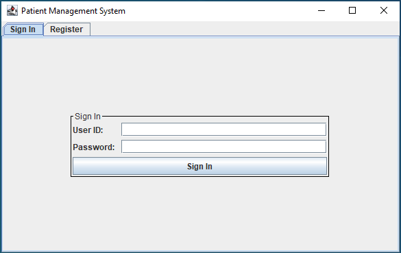
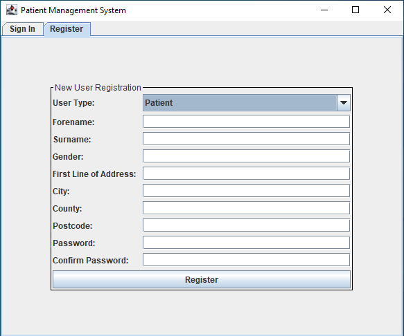
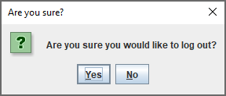
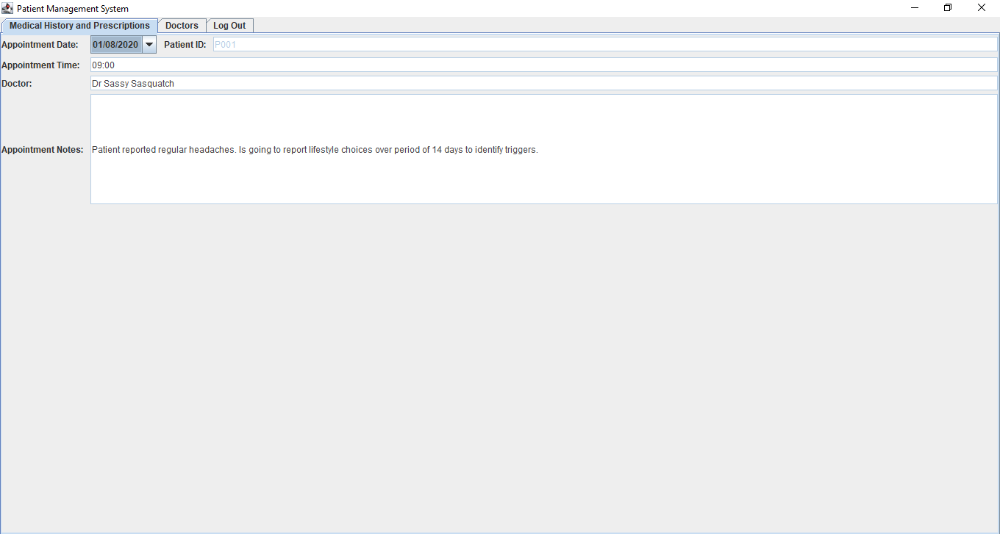
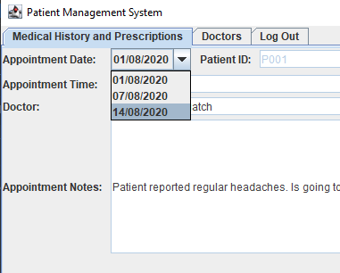
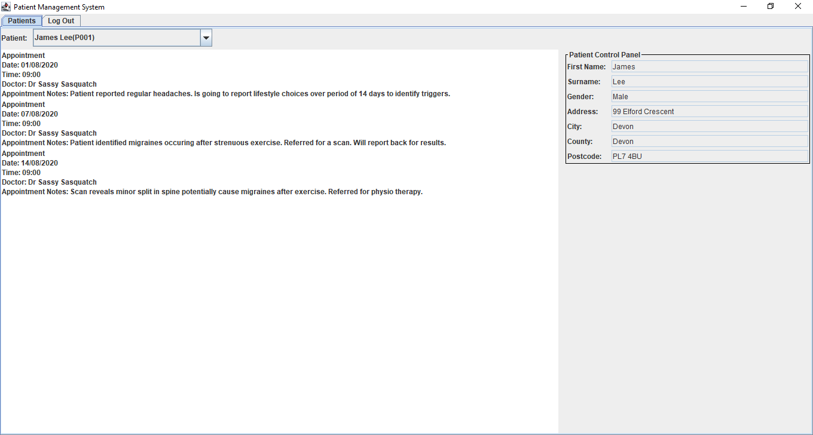
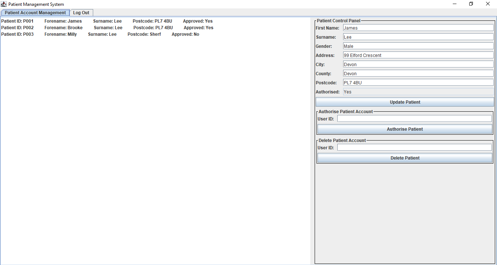
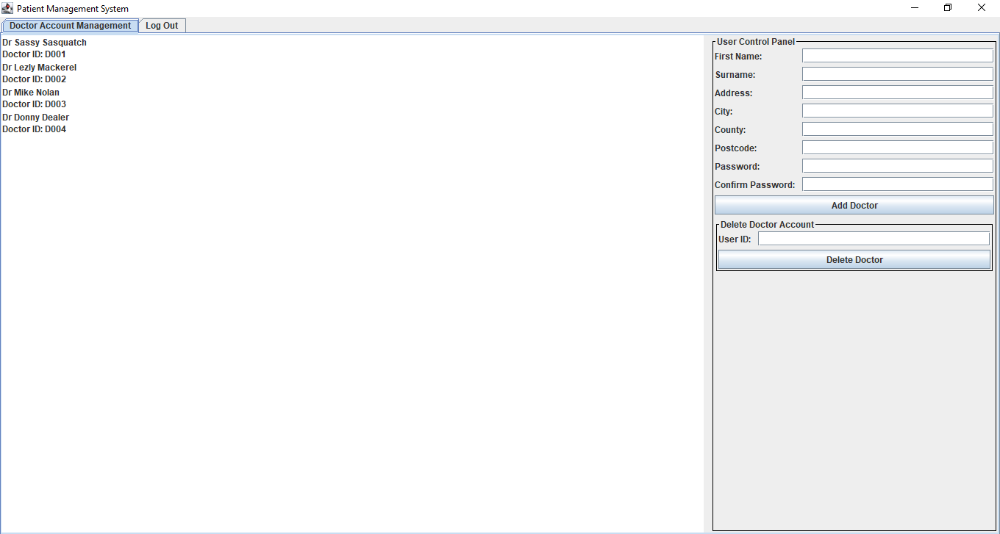

# Soft252 - Patient Management System
##### IDE: IntelliJ IDEA
This project has been created by myself as a part of my Soft252 project.

This is a patient management system preloaded with the following data:
* 3 Patients
* 4 Doctors
* 1 Secretary
* 1 Administrator

All data is created in the setUpData class and currently commented out. 
The data is serialized and stored in its appropriate .ser file.
This is due to an ongoing error when storing all serialized array lists as one data object.

#### System features currently in operation:
* User log in - a user is successfully able to log in to their account.

* User registration - a user is successfully able to register for a new account.
(Only applies to patients and administrators). A patient account will need to be
authorised by an administrator before it becomes functional.

* A user can log out from their account.  

* A patient can select an appointment from their appointment history using a drop down menu
which will then display the appointment details such as the doctor and notes in the relevant fields.

* A doctor can select a patient from a drop down menu and view their medical history.
All previous appointments are displayed in a JList. Patient details are also displayed in the relevant
fields besides the list.

* A secretary can view all registered patients in a JList.
By selecting a patient, the secretary can then view more patient details in their control
panel on the right of the page. This control panel can also be used to update patient
details, authorise patients, or delete patients.

* An administrator can view all doctor accounts, add new doctor accounts and delete existing doctor accounts.

#### JUnit testing and Javadoc:
* Appropriate class testing has been implemented using JUnit and all tests have passed.
* Javadoc comments have been implemented on all controllers to provide function documentation.

#### UML
UML diagram created with IntelliJ's built in UML generator. Stored in GitHub Repository.
[My UML](UML.png)

#### Project Troubleshooting
* I appreciate all data is meant to be stored in one data file however this was causing errors in my system.
I was attempting to store all arraylists in one data object however my system would not let me serialize this.
I overcame this by serializing each arraylist of objects into its own .ser file.
* Building an executable - I am able to build an executable of my project but cannot include my .ser storage
files with my .jar file. This means my system cannot read data so therefore cannot pass the login tab.
Please overcome this by running my system in IntelliJ. In IntelliJ my system runs perfectly.
 